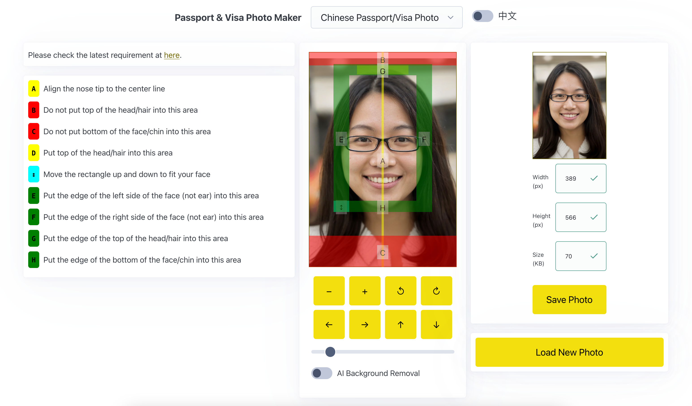
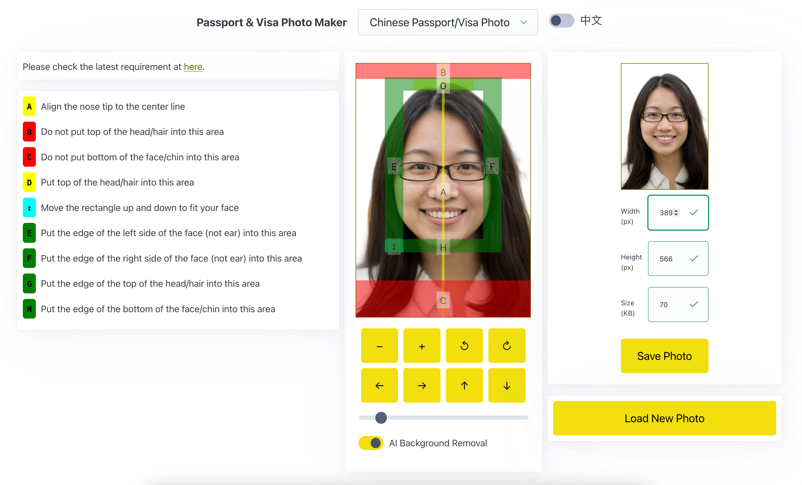
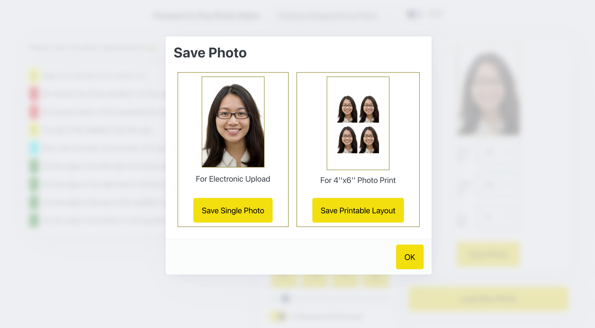
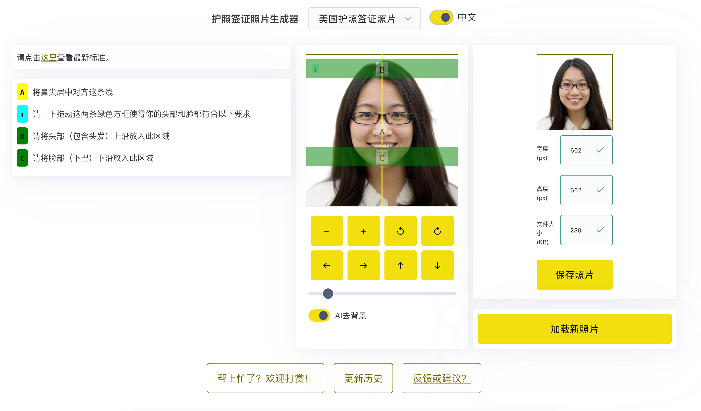

 

  

<h3 align="center">护照签证照片生成器 | Passport & Visa Photo Maker</h3>

  

    不需要任何图像处理知识，也不需要下载软件，只需要在手机浏览器里随便点点，或者电脑浏览器鼠标动动，就可以轻松去背景，并且快速生成符合不同国家标准的护照或签证照片。
     
    <a href="https://jiataihan.dev/passport-photo-maker/"><strong>{ 点击开始使用 }</strong></a>
     
    <a href="https://www.youtube.com/watch?v=z6podleci5E"><strong>{ 点击查看视频教程 }</strong></a>
     
  

<!-- ABOUT THE PROJECT -->
## 特色

* 网页版，自适应界面，可跨平台，跨设备使用（完美支持手机浏览器访问）
* 中英文双语界面，实时切换（已支持多语言，后期有必要可以轻易扩展）
* 多个国家的签证和护照照片模板以及参考信息，用JSON定义，可以快速添加
* AI自动去背景（不支持iPad或者iPhone等iOS设备）
* 可以鼠标/触摸直接操作图像区域，也可以用微调工具单击微调
* 鼠标或多点触摸实现图像平移缩放旋转，可进一步使用按钮微调，并实时预览生成图像
* 高清输出，可以设置输出尺寸，以及输出大小（上限）
* 可以生成单张图像用于电子版上传，也可以直接4"x6"标准相片尺寸进行打印

(<a href="#top">回到页首</a>)

* 主界面，中国护照签证照片模板

    

* AI去背景

    

* 生成单张或者4"x6"照片打印排版

    

* 美国护照和签证照片模板以及中文界面

    

## 简介

这是一款专为制作符合各国护照和签证要求的照片而设计的软件工具。它以用户友好、简洁高效为特点，能迅速生成符合使馆和领事馆最新指南的标准照片。软件提供了对于照片的多种调节方式，界面直观易用，即使是没有技术背景的用户也能轻松上手，为用户提供了一个便捷的解决方案，可以在家中快速制作出符合标准的照片。

(<a href="#top">回到页首</a>)

### Built With

* React
* JavaScript
* Node.js
* @imgly/background-removal 用于AI去背景
* @picocss/pico 界面UI框架
* pica@9.0.1 用于高品质缩放照片
* react-avatar-editor 用于作为图像编辑器
* react-draggable@4.4.6 用于生成可拖拽参考线

(<a href="#top">回到页首</a>)

### 已知问题

* <del>平移框拖拽时会超出画布界限的问题</del> (fixed: 2024-01-25)
* <del>图像大小是以网页实际画布大小为基础，假设中国护照照片是330x480px，在输出处调整大小也仅仅是插值拉伸，画质有较大损失，解决方法有两种：1，让画布本身变大，显示时等比缩小保证网页显示正确，输出时输出原画布大小；2，在输出时重新载入原图，利用记录的缩放平移坐标计算在原图基础上输出图像。鉴于护照签证照片一般文件尺寸要求都偏小，方案1目前更可靠。</del> (fixed: 2024-01-26)
* <del>初始阶段需要拖拽几次后才能正常平移，原因是第一次缩放时位移坐标没有正确初始化，会择机修复</del> (fixed: 2024-01-27)
* <del>当切换模版后，预览图片跟画布区域不匹配，需要拖动更新后才可以再次刷新匹配</del>(fixed: 2024-01-28)
* iOS下保存图片，并非存放于相机胶卷，而是自动保存至文件里，没有提示，可能需要额外处理iOS系统下保存文件的行为；

(<a href="#top">回到页首</a>)

### 待添加功能
* （欢迎在讨论区留言建议，或者其他开发者建立新的Branch来添加新功能）。

(<a href="#top">回到页首</a>)

